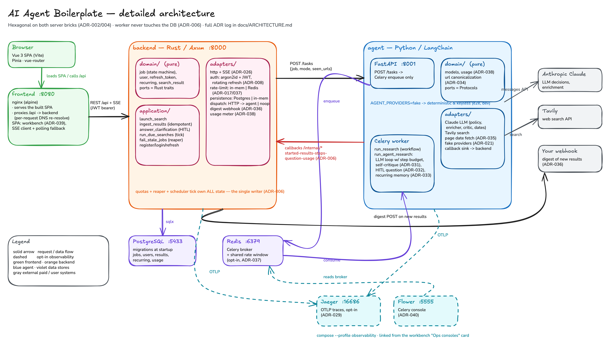

# AI Agent Boilerplate

[](https://github.com/christopheduc-me/ai-agent-boilerplate/actions/workflows/ci.yml)
[](https://github.com/christopheduc-me/ai-agent-boilerplate/actions/workflows/security.yml)
[](https://codecov.io/gh/christopheduc-me/ai-agent-boilerplate)
[](LICENSE)
[](https://github.com/christopheduc-me/ai-agent-boilerplate/commits/main)

[](backend/)
[](agent/)
[](frontend/)
[](docker-compose.yml)
[](docs/ARCHITECTURE.md)

**A production-shaped, fully documented boilerplate for building AI-agent web
applications** — Rust API, Python agent workers, Vue frontend, wired together
with the plumbing real deployments need.

The demo product is deliberately simple: users sign up, enter a keyword, and
launch a research that classifies and summarizes each finding and renders
everything as a **timeline** sorted by publication date (live-updated over
SSE) — in either of two modes, side by side. **Workflow**: the fixed pipeline
(one search, enrich, sort). **Agent**: an agentic loop where the LLM picks its
own queries, judges coverage, refines, asks you a clarification question when
the goal is ambiguous, decides when to stop and reviews its own results before
delivering, streaming its **decision journal** live to the browser. The value is everything around it —
the patterns you would otherwise rebuild from scratch on every agent project.

## What you get

- **Hexagonal architecture on both server bricks** — pure domains with zero
  infrastructure dependencies; use cases depend on ports (Rust traits / Python
  Protocols); adapters implement them. Swapping the LLM, the search provider,
  or the database is configuration, not surgery — including running the agent
  on a **local model** (`AGENT_LLM_BACKEND=ollama`, ADR-041) instead of the
  Anthropic API, with an **evaluation harness** to compare models on the
  agent's own tasks (ADR-045).
- **TDD throughout** — 190+ tests; the domain is tested with fakes of the ports,
  and **no test ever calls a paid service** (live provider tests are opt-in
  behind `RUN_LIVE_TESTS=1`).
- **Reliable job lifecycle** — `pending → running → completed/failed` with a
  timeout reaper for stuck jobs, Celery retries with backoff, and end-to-end
  idempotence (safe re-delivery, no duplicates).
- **Real auth** — argon2id passwords, short-lived JWT access tokens, single-use
  refresh tokens (SHA-256-hashed at rest, rotated on every refresh, HttpOnly
  cookie), silent session restore on page reload.
- **Abuse protection** — per-user daily search quota (LLM calls cost money) and
  per-IP rate limiting on auth and API routes.
- **Observability** — `X-Request-Id` correlation propagated across all four
  processes, structured JSON logs behind a `LOG_FORMAT` switch, and opt-in
  OpenTelemetry traces (one search = one distributed trace, local Jaeger via a
  compose profile) plus a Flower console for the Celery workers — both linked
  from the app's "Ops consoles" card.
- **Fully containerized** — multi-stage Dockerfiles, one compose file for dev
  (infra-only or full profile) and a production override with Caddy/TLS.
- **CI** — GitHub Actions: lint + test on every PR, images published to GHCR
  on `main`, and weekly security audits (cargo/pip/npm audit + gitleaks). A
  GitLab CI mirror (`.gitlab-ci.yml`) ships for GitLab-hosted forks, including
  a reference VPS deploy job.
- **Workflow *and* agent, one plumbing** — the same job pipeline runs a fixed
  deterministic workflow or an LLM-driven decision loop (budget-capped, URL
  deduplication, live decision journal over SSE), so the boilerplate
  demonstrates both canonical patterns and the trade-off between them.
- **LangGraph, hexagonally** — the agent mode runs on a **LangGraph
  `StateGraph`** by default (durable Redis checkpointing, native
  `interrupt()`-based human-in-the-loop that resumes mid-graph), wired as an
  adapter over the same domain ports — so the framework stays at the edge and
  the framework-free loop is still there behind `AGENT_ORCHESTRATOR=loop`
  (ADR-046).
- **Recurring searches with memory** — saved keywords re-run on an interval by
  the backend scheduler; each run remembers previously delivered URLs, flags
  what is **new**, the agent reports the delta ("nothing new since the last
  run"), and an optional **digest webhook** pushes the news to your systems
  (Slack, n8n, anything with a URL) — the building block for monitoring/watch
  use cases.
- **Per-run cost tracking** — every run reports its real API spend (Claude
  tokens + search calls, env-configurable rates); the UI shows the cost per
  search and the total, so "LLM calls cost money" stops being abstract.
- **Every decision written down** — 55 Architecture Decision Records in
  [docs/ARCHITECTURE.md](docs/ARCHITECTURE.md), including the rejected
  alternatives and the trade-offs.

## Architecture

[](docs/diagrams/architecture.png)

The worker never touches the database — results flow back through
authenticated HTTP callbacks, so a single application owns the schema
([ADR-006](docs/ARCHITECTURE.md)). The diagram is an editable
[Excalidraw file](docs/diagrams/architecture.excalidraw) — see
[docs/diagrams/](docs/diagrams/README.md) for the full catalog.

## Stack

| Brick | Tech |
|---|---|
| `backend/` | Rust, Axum, sqlx — web API, accounts, job orchestration (hexagonal) |
| `agent/` | Python, LangChain (Claude) + Celery — research agent (hexagonal), FastAPI micro-API |
| `frontend/` | Vue 3, Vite, Pinia — SPA with silent token refresh |
| Infra | PostgreSQL 16, Redis 7, Docker, Caddy, GitHub Actions (GitLab CI mirror) |

## Quick start

Prerequisites: Docker, Rust, [uv](https://docs.astral.sh/uv), Node 22.
API keys: [Anthropic](https://console.anthropic.com) and
[Tavily](https://app.tavily.com) (free tier).

```sh
cp .env.example .env          # fill in ANTHROPIC_API_KEY and TAVILY_API_KEY

docker compose up -d          # infra only: PostgreSQL + Redis

# Terminal 1 — Rust backend (http://localhost:8000)
cd backend && cargo run

# Terminal 2 — agent micro-API (http://localhost:8001)
cd agent && uv sync && uv run uvicorn aiagent.adapters.api.app:app --port 8001

# Terminal 3 — Celery worker
cd agent && uv run celery -A aiagent.celery_app worker --loglevel=info

# Terminal 4 — frontend (http://localhost:5173)
cd frontend && npm install && npm run dev
```

Or run the fully containerized stack (what CI builds):

```sh
docker compose --profile full up --build   # frontend on http://localhost:8080
```

## Tests

```sh
cd backend && cargo test         # domain + use cases with port fakes; +Postgres tests when DATABASE_URL is set
cd agent && uv run pytest        # domain + use cases, Celery in eager mode
cd frontend && npm test          # vitest + Vue Test Utils
cd frontend && npm run test:e2e  # Playwright browser journey against the compose stack (keyless)
```

## Repository layout

```
backend/src/domain/             # entities + ports (traits) — no infrastructure deps
backend/src/application/        # use cases, unit-tested with fakes
backend/src/adapters/           # http (axum), persistence (sqlx/in-memory), auth, dispatch
agent/src/aiagent/domain/       # results, date normalization, sorting + ports (Protocols)
agent/src/aiagent/application/  # run_research use case (date cascade)
agent/src/aiagent/adapters/     # tavily, llm (Claude), sink (callbacks), api (FastAPI)
frontend/src/                   # Vue 3 SPA
deploy/                         # production-only files for forks (compose override, Caddyfile)
docs/                           # ARCHITECTURE.md (55 ADRs), FORKING.md, COMMANDS.md, diagrams/
```

## Documentation

- [docs/FORKING.md](docs/FORKING.md) — **make it yours**: swap the example
  domain for your own agent task at the hexagonal seams, keep the infrastructure.
- [docs/ARCHITECTURE.md](docs/ARCHITECTURE.md) — every technical decision
  (ADR-001 → ADR-057), kept in sync with the code at all times.
- [docs/OBSERVABILITY.md](docs/OBSERVABILITY.md) — the three pillars (traces,
  logs, metrics), what to measure and where to find it.
- [docs/COMMANDS.md](docs/COMMANDS.md) — every dev/test/deploy command.
- [docs/diagrams/](docs/diagrams/README.md) — PlantUML diagrams with an
  illustrated index: hexagonal architecture, job lifecycle state machine,
  the agentic loop, human-in-the-loop and auth flows.
- [SETUP.md](SETUP.md) — manual setup checklist (local env, CI, VPS, API keys).
- [ROADMAP.md](ROADMAP.md) — the prioritized technical roadmap.

## Deployment (for your fork)

This repository is source code only — **it deploys nothing itself**. Fork it
and deploy on your own infrastructure: everything is provided for a
single-VPS setup with docker compose behind Caddy (automatic TLS) —
production compose override, step-by-step provisioning checklist
([SETUP.md](SETUP.md) §4), and a reference CI deploy job in the GitLab mirror.
Reproducible by design: images are pinned to the commit SHA, and a rollback is
redeploying the previous tag. See [docs/ARCHITECTURE.md](docs/ARCHITECTURE.md)
(ADR-015/019).

## Contributing

Fork → short-lived branch → PR against `main`. CI must be green; PRs are
squash-merged. See [CONTRIBUTING.md](CONTRIBUTING.md) for the ground rules
(English only, TDD, architecture doc kept in sync).

## License

MIT — see [LICENSE](LICENSE).
