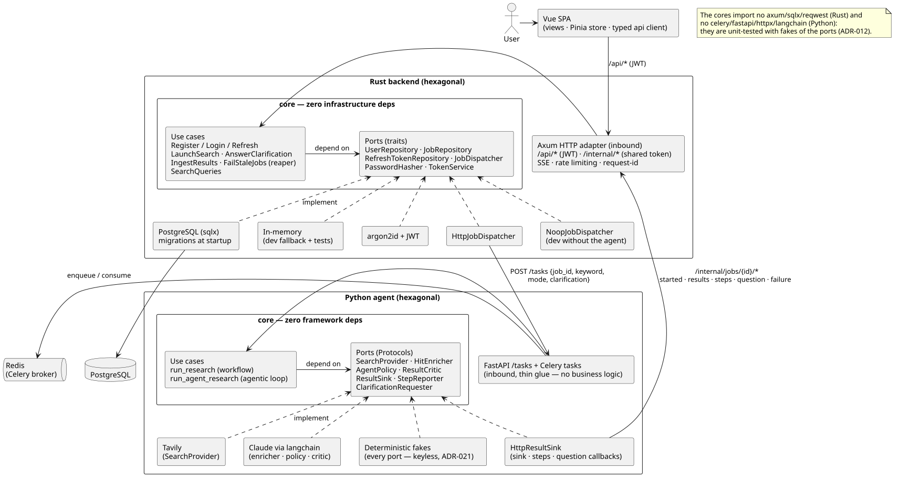
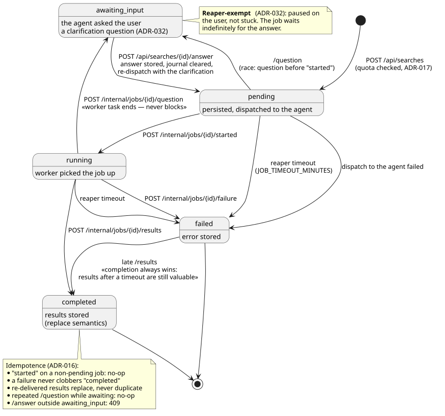
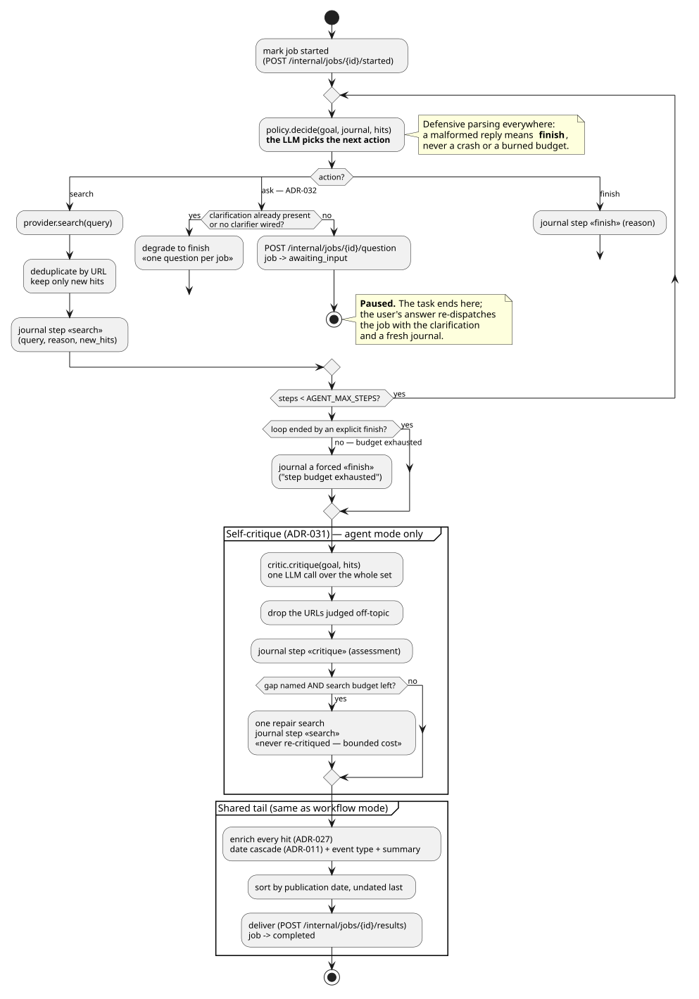
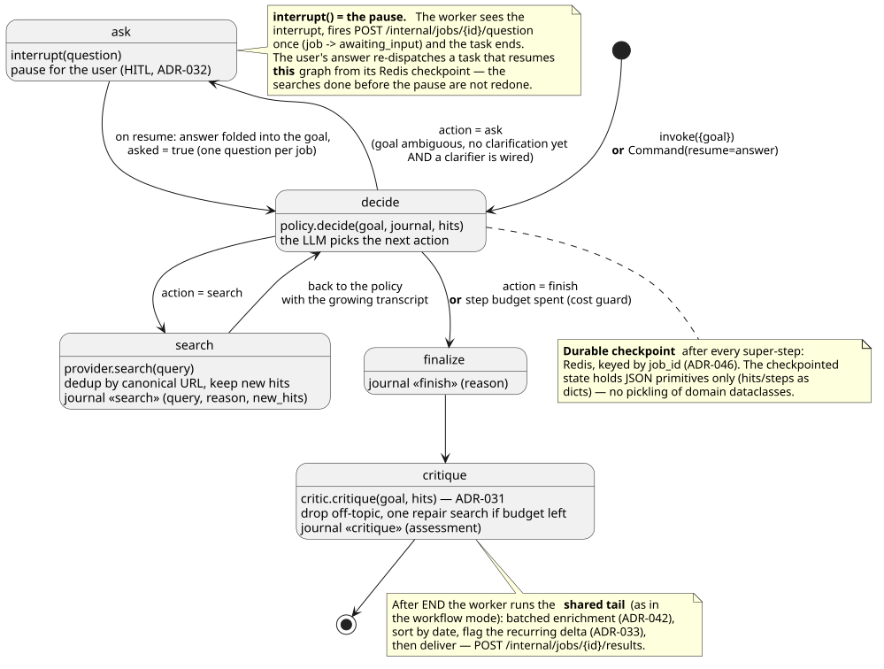
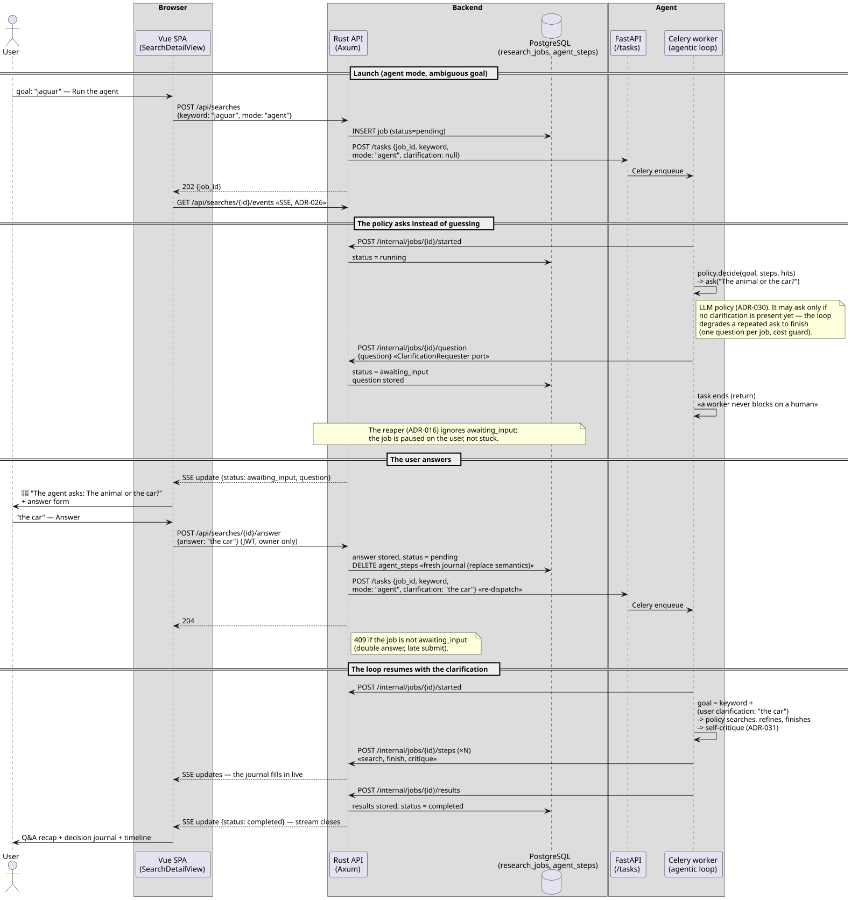
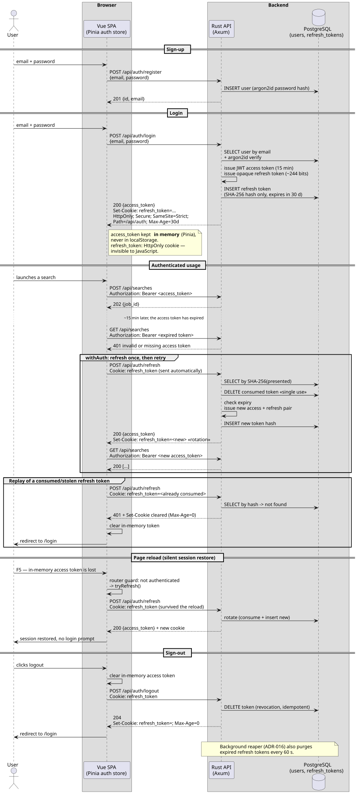

# Diagrams

One page to browse every diagram without opening the `.puml` files one by one.
Each entry embeds the rendered SVG (committed next to its source) and lists
what the diagram is meant to make visible.

Regenerate the renders after editing a source (see also `docs/COMMANDS.md`):

```sh
plantuml -tsvg docs/diagrams/*.puml
```

---

## Detailed architecture — the runtime view (Excalidraw, editable)

**Source**: [architecture.excalidraw](architecture.excalidraw) ·
**Render**: [architecture.png](architecture.png) (embedded in the root README)

**The question it answers: what runs, on which port, and who talks to whom.**
This is the diagram for deploying, debugging a dead connection, or following
one search across the four processes. Its logical sibling below (the
hexagonal PlantUML) answers the *why is it built this way* question — the two
deliberately overlap on the brick internals but are kept separate on purpose.

[](architecture.png)

The whole system on one hand-drawn canvas: every container with its port, the
hexagonal internals of both server bricks (domain / application / adapters
with their key ADRs), the two inter-brick HTTP contracts (`POST /tasks` and
the `/internal/*` callbacks — ADR-006), the data stores, the paid external
APIs, the digest webhook, and the opt-in observability consoles (Jaeger,
Flower).

Unlike the PlantUML sources below, this one is meant to be **edited visually**:
open the file at [excalidraw.com](https://excalidraw.com) (menu → Open) or
with the VS Code *Excalidraw* extension, rearrange, then save it back — the
`.excalidraw` file is the source of truth. After editing, re-export the
committed render (app menu → Export image → PNG, scale 2×, with background)
and overwrite `architecture.png` so the READMEs stay in sync.

---

## Hexagonal architecture — the logical view (both server bricks)

**Source**: [hexagonal-architecture.puml](hexagonal-architecture.puml) · **ADRs**: 002, 004, 012, 021

**The question it answers: why is it testable and swappable.** Where the
runtime view above shows what runs, this one shows the ports-and-adapters
structure that no deployment diagram can carry — in particular each port's
production/test adapter pair, which is the argument the whole boilerplate
rests on.

The 10-second version of the architecture argument: two pure cores (no
axum/sqlx/reqwest on the Rust side, no celery/fastapi/httpx/langchain on the
Python side), use cases that depend only on **ports** (traits / Protocols),
and the adapters that implement them. Worth noticing:

- every port has a **production adapter and a test/keyless twin** side by side
  (PostgreSQL ↔ in-memory, Tavily/Claude ↔ deterministic fakes, HTTP dispatcher
  ↔ noop) — this is what makes TDD without paid services (ADR-012) and the
  keyless e2e (ADR-021) possible;
- the only paths between the bricks are the two HTTP contracts:
  `POST /tasks` (dispatch) and `/internal/jobs/{id}/*` (callbacks) — the
  worker never touches the database (ADR-006).



---

## Job lifecycle — state machine

**Source**: [job-lifecycle-states.puml](job-lifecycle-states.puml) · **ADRs**: 016, 017, 032

Every state a `research_job` can be in and every transition — each one is a
worker callback, a user action, or the reaper. The details that matter (and
that a fork breaks first when it doesn't know them):

- **idempotence everywhere**: `started` on a non-pending job is a no-op,
  re-delivered results replace instead of duplicating, a repeated question is
  harmless — Celery retries are safe by construction;
- **completion always wins**: results arriving after a reaper timeout
  overwrite the failure; a failure never clobbers a completed job;
- **`awaiting_input` is reaper-exempt** (ADR-032): paused on the user, not
  stuck — and the answer sends the job back through `pending` with a cleared
  journal.



---

## The agentic loop — activity diagram

**Source**: [agentic-loop.puml](agentic-loop.puml) · **ADRs**: 030, 031, 032

The **decision flow** of the agent mode — the queries, the ask, the finish, the
self-critique. It applies to **both orchestrators** (ADR-046): it is the
literal shape of the hand-rolled loop (`AGENT_ORCHESTRATOR=loop`) and the
decision logic the LangGraph `StateGraph` reproduces node-for-node. For the
graph's own topology (nodes, edges, checkpoint, interrupt), see the next
diagram.

What actually happens inside the loop, the boilerplate's flagship
feature, in one visual instead of three ADRs:

- the **LLM policy drives the control flow** (search / ask / finish); the loop
  only enforces the mechanics — URL deduplication, the `AGENT_MAX_STEPS` step
  budget and the `AGENT_MAX_COST_USD` spend cap (ADR-048), the live journal;
- **defensive parsing** as a design rule: any malformed LLM reply means
  *finish*, never a crash or a burned budget;
- the **ask** branch (ADR-032) ends the task — a worker never blocks on a
  human — and the guard that degrades a repeated ask to finish;
- the **self-critique** partition (ADR-031): one review call, off-topic drops,
  at most one repair search, never re-critiqued (bounded cost);
- the **shared tail** (enrich → sort → deliver) that agent and workflow modes
  have in common.



---

## The agent's LangGraph execution graph — StateGraph (default orchestrator)

**Source**: [langgraph-agent-graph.puml](langgraph-agent-graph.puml) · **ADRs**: 046 (031, 032, 033, 042)

The **topology** of the default agent orchestrator (ADR-046): the LangGraph
`StateGraph` whose nodes call the same domain ports as the loop above. Where
the activity diagram shows *what the agent decides*, this shows *how the graph
is wired* — and the two things a graph buys over the plain loop:

- the nodes (`decide` → `search` / `ask` / `finalize` → `critique`) and the
  conditional edges the policy's action selects, with the budget-bounded
  `search → decide` cycle;
- **`interrupt()` as the HITL pause** (ADR-032): the worker fires the
  `question` callback once and ends; the answer resumes **this** graph from its
  checkpoint, so the searches done before the pause are not redone;
- the **durable Redis checkpoint** (keyed by `job_id`) taken at every
  super-step, holding JSON primitives only;
- the **shared tail** after `END` (batched enrich → sort → deliver) common with
  the workflow mode.



---

## Human-in-the-loop clarification — sequence

**Source**: [hitl-clarification-flow.puml](hitl-clarification-flow.puml) · **ADRs**: 026, 030, 032

The full journey of an ambiguous goal across all four processes: launch in
agent mode → the policy asks instead of guessing → the job pauses in
`awaiting_input` (the Celery task **ends**, nothing blocks) → the SSE stream
pushes the question to the browser → the user answers → re-dispatch with the
clarification and a fresh journal → the loop resumes to completion. Also
shows where the 409 lives (answering a job that is not awaiting) and why the
reaper leaves paused jobs alone.



---

## Auth and refresh tokens — sequence

**Source**: [auth-refresh-flow.puml](auth-refresh-flow.puml) · **ADRs**: 008, 016

The whole session story: sign-up, login, the access token kept **in memory
only** with the refresh token in an HttpOnly cookie, the silent
refresh-and-retry on 401 (`withAuth`), single-use rotation, what happens when
a consumed/stolen refresh token is replayed, the silent session restore on
page reload, and revocation on logout.


